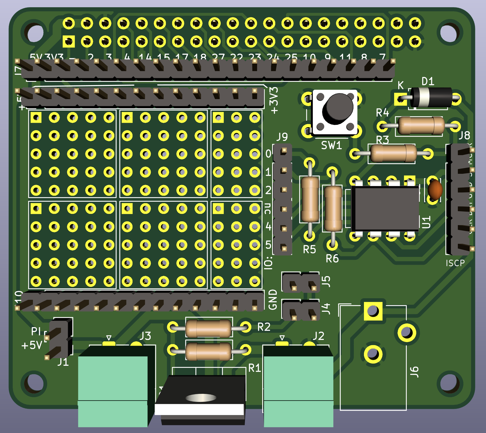
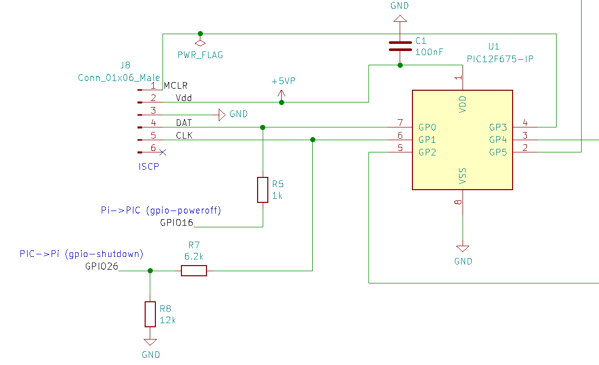
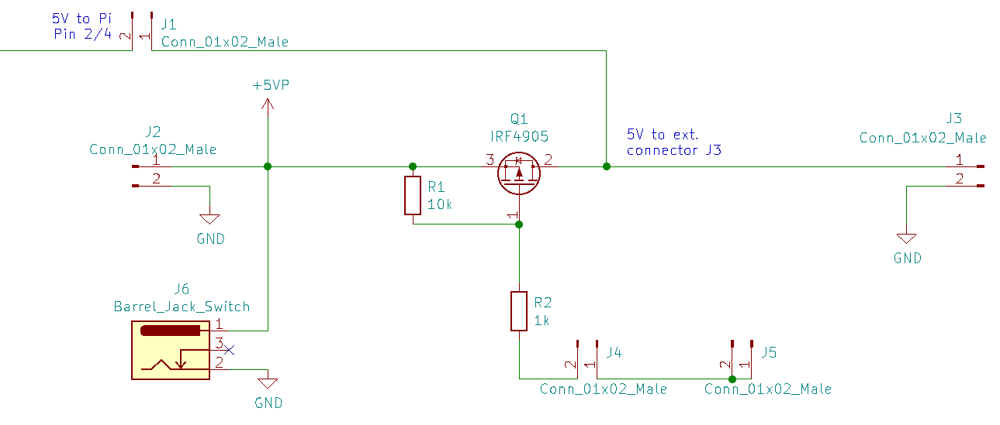
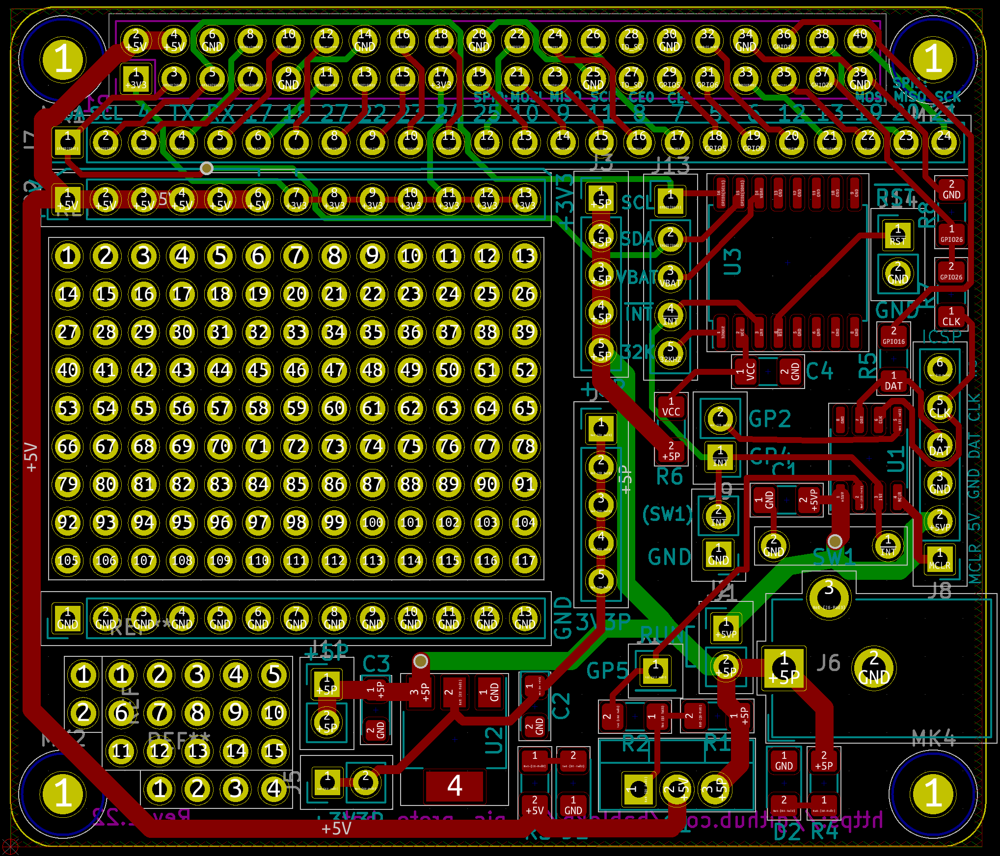

The Pi-PIC-Proto-Hat
====================

Overview
--------

One of the shortcomings of the Pi is it's inability to turn off power after
shutdown. While the Pi itself only drains a small amount of power, attached
peripherals might draw a lot more. At irregular intervals, the Pi also
fails to shutdown the USB-connector, so USB-devices can really use large
amounts of power even when the Pi has shutdown.

One solution is to pull the plug, another one uses a mosfet controlled by
a microcontroller to turn power on and off. The MCU typically uses its
GPIOs to receive external signals for power on and off. In its simplest
form such a signal is just a button pulling the GPIO to ground.

The pi-pic-proto-hat provides the wiring for a PIC12F675 (MCU) and the
IRF4905 (mosfet). In addition, there is a small prototyping area for
buttons, sensors and alike.

If you are more familiar with a different family of MCUs (e.g. Atmega), you
should modify the design of the pcb. The Kicad-sources are in the
directory `pi-pic-proto-hat.kicad`.

Design
------

The design consists mainly of the two parts "power supply" and "PIC".
The PIC part

is a fairly standard implementation for the PIC featuring an
ISCP (in-circuit-programming) connector J8
and a connector for the pins GP0-GP2 and GP4-GP5. GP3 is connected to a
switch. Pulling GP3 to ground will reset the MCU.

If you are not using a MCU of the PIC-family, this is the part you must
modify to fit your preferred MCU.

The power-supply part

gives you multiple options for connecting a power-supply. J6 is for a
barrel-jack (5mm/2.1mm-type). As an alternative, you can use J2. Power is fed
to either the Pi via J1 (close with a jumper-shim) or to an external
device via J3.

The IRF4905 mosfet will switch power efficiently as long as the voltage
of the gate is high enough. The 5V of the MCU is sufficient and the
mosfet will not get too warm with the typical currents needed by a Pi.

The pcb also provides access to most of the GPIOs of the Pi. In addition,
there is a prototyping area and a number of GND-pins and power pins
(5V and 3,3V).

Manufacturing
-------------

If your pcb-manufacturer supports Kicad directly, you can just upload the
project-file. Otherwise you have to start Kicad and export ("plot") the
gerber-files for the pcb (gerber is a universal format understood by all
manufacturers).

When you use the existing pcb-layout without any modifications, you should
make sure that you have the correct parts available. Most critical is the
barrel-jack footprint. The pcb is designed for the CUI_PJ_102AH. This part
is available e.g. from Adafruit. It looks like a normal barrel-jack adapter
but has smaller pins so you can use it directly on a breadboard.

Wiring
------

The PIC is not connected to the mosfet by default. To connect the PIC with
the mosfet, you have to add a connection from one of the IO-pins of the PIC
(J9) to J5 and also close J4 with a jumper.

When the gate of the mosfet is high, 5V will be at pin 2 of the mosfet. This
is connected to the connector J3 (to provide power to an external device), and
via jumper J1 with pins 2/4 of of the Pi. Depending on your usage-scenario,
you might not need the connector J3 at all.

Please be careful not to power the hat and the Pi at the same time.
 

Flashing a Firmware
-------------------

The required firmware for the PIC depends on the specific setup you choose.
In the directory [example-setup](./example-setup/Readme.md)
you will find a ready to flash hex-file for a very basic setup with a
on/off-button as external signal. The firmware also supports a second
external signal.

For flashing, you need a PICkit2-programmer, available for a few bucks from
ebay. You can flash from Linux/Raspbian with the program `pk2cmd`. The hat
has a connector for the ISCP-programmer.
