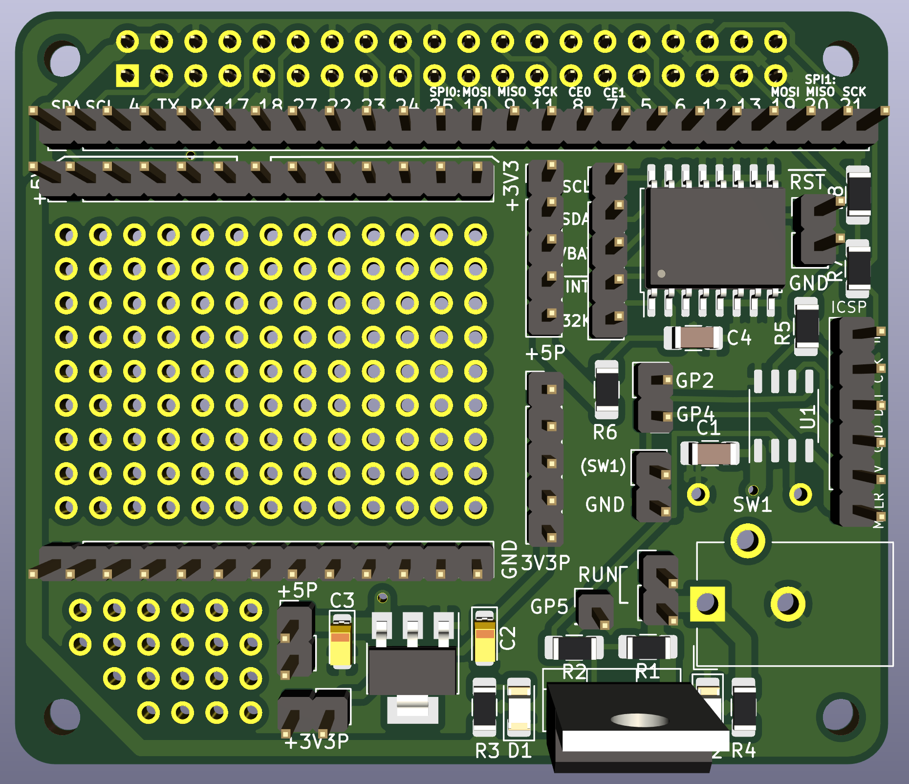

The Pi-PIC-Proto-Hat
====================

Overview
--------

One of the shortcomings of the Pi is it's inability to turn off power after
shutdown. While the Pi itself only drains a small amount of power, attached
peripherals might draw a lot more. At irregular intervals, the Pi also
fails to shutdown the USB-connector, so USB-devices can really use large
amounts of power even when the Pi has shutdown.

One solution is to pull the plug, another one uses a mosfet controlled by
a microcontroller to turn power on and off. The MCU typically uses its
GPIOs to receive external signals for power on and off. In its simplest
form such a signal is just a button pulling the GPIO to ground.

The pi-pic-proto-hat provides the wiring for a PIC12F675 (MCU) and the
IRF4905 (mosfet). In addition, there is a small prototyping area for
buttons, sensors and alike.

If you are more familiar with a different family of MCUs (e.g. Atmega), you
should modify the design of the pcb. The Kicad-sources are in the
directory `pi-pic-proto-hat.kicad`.

Manufacturing
-------------

If your pcb-manufacturer supports Kicad directly, you can just upload the
project-file. Otherwise you have to start Kicad and export ("plot") the
gerber-files for the pcb (gerber is a universal format understood by all
manufacturers).

Flashing a Firmware
-------------------

The required firmware for the PIC depends on the specific setup you choose.
In the directory [example-setup.firmware](./example-setup.firmware/Readme.md)
you will find a ready to flash hex-file for a very basic setup with a
on/off-button as external signal. The firmware also supports a second
external signal.

For flashing, you need a PICkit2-programmer, available for a few bucks from
ebay. You can flash from Linux/Raspbian with the program `pk2cmd`. The hat
has a connector for the ISCP-programmer.
