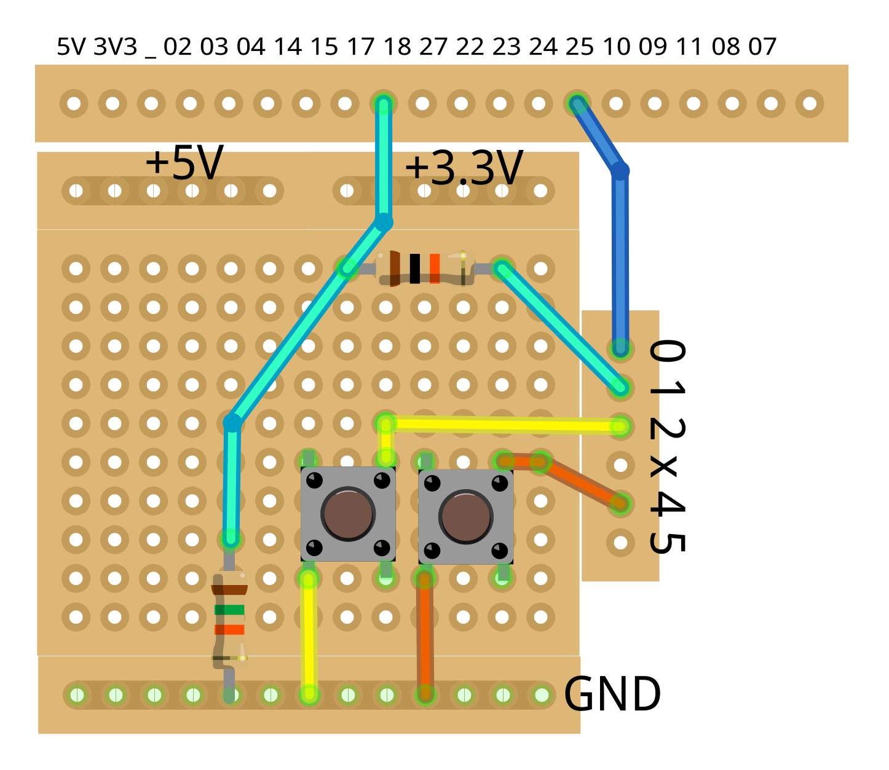

Example Firmware
================

The file `example-firmware.hex` in this directory is a ready to flash
program for the pic. It supports a basic setup, in which two buttons
are used as external signals to start and shutdown the Pi:

A possible implementation on the prototyping-area shows this
Fritzing view:

Note that only one button is actually necessary, the schematic only
illustrates that you can have two external signals to trigger boot or
shutdown. In a real-world scenario the second signal would be sensor
or maybe a rtc-clock.

You can find the source-code of the firmware, along with additional
information about necessary connections and configurations on the Pi-side
in the directory `src/rpi_mosfet_on_off` in the project
[pic-toolchain](https://github.com/bablokb/pic-toolchain).
